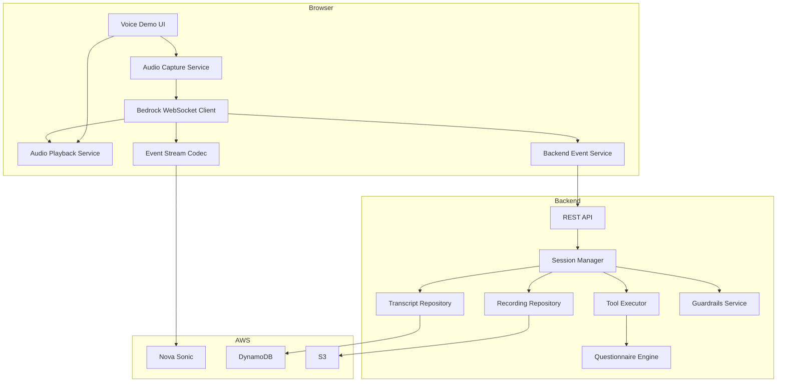
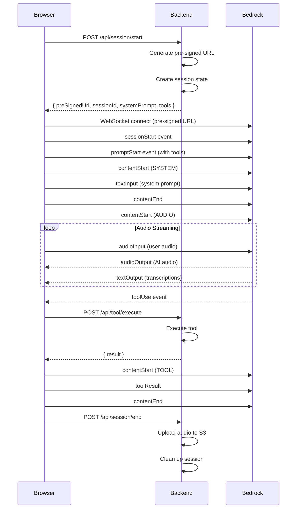

# Design Document: Direct WebSocket to Bedrock

## Overview

This design describes the architecture for enabling direct WebSocket connections from the browser to Amazon Bedrock Nova Sonic, matching the approach used by the Amazon Bedrock Playground. The key change is moving the Bedrock WebSocket connection from the backend to the frontend, while preserving all existing demo functionality through a coordination layer.

### Current Architecture (Proxy Mode)
```
Browser → WebSocket → Backend → HTTP/2 SDK → Bedrock
```

### New Architecture (Direct Mode)
```
Browser → WebSocket → Bedrock (audio streaming)
Browser → WebSocket → Backend (tool execution, session management)
```

## Architecture

### High-Level Component Diagram



### Connection Flow



## Components and Interfaces

### Backend Components

#### 1. Pre-Signed URL Generator

Generates AWS SigV4 pre-signed WebSocket URLs for Bedrock.

```typescript
interface PreSignedUrlGenerator {
  generateUrl(config: UrlConfig): Promise<PreSignedUrlResult>;
}

interface UrlConfig {
  region: string;
  modelId: string;
  expirationSeconds?: number; // default: 300 (5 minutes)
}

interface PreSignedUrlResult {
  url: string;
  expiresAt: Date;
}
```

#### 2. Session Manager (Updated)

Manages session state without Bedrock stream management.

```typescript
interface SessionManager {
  createSession(config: SessionConfig): Promise<SessionInfo>;
  getSession(sessionId: string): Promise<Session | null>;
  updateSession(sessionId: string, updates: Partial<Session>): Promise<void>;
  endSession(sessionId: string): Promise<SessionSummary>;
}

interface SessionConfig {
  questionnaireId: string;
  voiceId: string;
}

interface SessionInfo {
  sessionId: string;
  preSignedUrl: string;
  systemPrompt: string;
  tools: ToolDefinition[];
  questionnaire: QuestionnaireConfig;
}
```

#### 3. Tool Executor (Existing)

Executes tools requested by Nova Sonic.

```typescript
interface ToolExecutor {
  execute(request: ToolRequest): Promise<ToolResult>;
}

interface ToolRequest {
  sessionId: string;
  toolName: string;
  toolUseId: string;
  parameters: Record<string, any>;
}

interface ToolResult {
  success: boolean;
  data?: any;
  error?: string;
}
```

#### 4. Transcript Handler

Handles transcription events from frontend.

```typescript
interface TranscriptHandler {
  handleUserTranscript(sessionId: string, transcript: TranscriptData): Promise<void>;
  handleAssistantTranscript(sessionId: string, transcript: TranscriptData): Promise<void>;
}

interface TranscriptData {
  content: string;
  timestamp: number;
  isFinal: boolean;
}
```

#### 5. Audio Recording Handler

Handles audio chunks for recording.

```typescript
interface AudioRecordingHandler {
  addUserAudioChunk(sessionId: string, audioData: Buffer): void;
  addAssistantAudioChunk(sessionId: string, audioData: Buffer): void;
  finalizeRecording(sessionId: string): Promise<string>; // Returns S3 URL
}
```

### Frontend Components

#### 1. Bedrock WebSocket Client

Manages direct WebSocket connection to Bedrock.

```typescript
interface BedrockWebSocketClient {
  connect(preSignedUrl: string): Promise<void>;
  disconnect(): void;
  sendEvent(event: BedrockEvent): void;
  onEvent(handler: (event: BedrockEvent) => void): void;
  onError(handler: (error: Error) => void): void;
  onClose(handler: () => void): void;
}
```

#### 2. Event Stream Codec

Encodes/decodes AWS Event Stream binary format.

```typescript
interface EventStreamCodec {
  encode(event: BedrockEvent): ArrayBuffer;
  decode(data: ArrayBuffer): BedrockEvent;
}

interface BedrockEvent {
  headers: EventHeaders;
  payload: any;
}

interface EventHeaders {
  ':event-type': string;
  ':message-type': string;
  ':content-type': string;
}
```

#### 3. Backend Event Service

Communicates with backend for tool execution and session management.

```typescript
interface BackendEventService {
  startSession(config: SessionConfig): Promise<SessionInfo>;
  executeTool(request: ToolRequest): Promise<ToolResult>;
  sendTranscript(sessionId: string, transcript: TranscriptData): Promise<void>;
  sendAudioChunk(sessionId: string, audioData: string, source: 'user' | 'assistant'): Promise<void>;
  endSession(sessionId: string): Promise<SessionSummary>;
}
```

### REST API Endpoints

#### POST /api/session/start
Creates a new session and returns pre-signed URL.

Request:
```json
{
  "questionnaireId": "demo1_csat_nps",
  "voiceId": "matthew"
}
```

Response:
```json
{
  "sessionId": "uuid",
  "preSignedUrl": "wss://bedrock-runtime...",
  "systemPrompt": "You are a professional survey interviewer...",
  "tools": [...],
  "questionnaire": {...}
}
```

#### POST /api/tool/execute
Executes a tool and returns result.

Request:
```json
{
  "sessionId": "uuid",
  "toolName": "record_response",
  "toolUseId": "tool-uuid",
  "parameters": {
    "questionId": "q1",
    "response": "Very satisfied"
  }
}
```

Response:
```json
{
  "success": true,
  "data": {
    "recorded": true,
    "nextQuestion": {...}
  }
}
```

#### POST /api/transcript
Records a transcript.

Request:
```json
{
  "sessionId": "uuid",
  "role": "user",
  "content": "I am very satisfied",
  "timestamp": 1703123456789,
  "isFinal": true
}
```

#### POST /api/audio/chunk
Records an audio chunk.

Request:
```json
{
  "sessionId": "uuid",
  "source": "user",
  "audioData": "base64-encoded-pcm"
}
```

#### POST /api/session/end
Ends a session and finalizes recording.

Request:
```json
{
  "sessionId": "uuid",
  "reason": "completed"
}
```

Response:
```json
{
  "summary": {
    "duration": 245,
    "questionsAnswered": 5,
    "recordingUrl": "s3://..."
  }
}
```

## Data Models

### Session State

```typescript
interface Session {
  sessionId: string;
  questionnaireId: string;
  voiceId: string;
  currentQuestionIndex: number;
  responses: Map<string, Response>;
  visitedQuestions: Set<string>;
  conversationHistory: ConversationTurn[];
  startTime: Date;
  lastActivityTime: Date;
  status: 'active' | 'completed' | 'terminated' | 'error';
  connectionMode: 'direct' | 'proxy';
}
```

### Pre-Signed URL Parameters

```typescript
interface SigV4Parameters {
  'X-Amz-Algorithm': 'AWS4-HMAC-SHA256';
  'X-Amz-Credential': string; // {accessKeyId}/{date}/{region}/bedrock/aws4_request
  'X-Amz-Date': string; // ISO 8601 format
  'X-Amz-SignedHeaders': 'host';
  'X-Amz-Signature': string; // HMAC-SHA256 signature
  'X-Amz-Expires'?: string; // Expiration in seconds
}
```

### Bedrock Event Types

```typescript
// Outgoing events (to Bedrock)
type OutgoingEvent = 
  | SessionStartEvent
  | PromptStartEvent
  | ContentStartEvent
  | TextInputEvent
  | AudioInputEvent
  | ToolResultEvent
  | ContentEndEvent
  | PromptEndEvent
  | SessionEndEvent;

// Incoming events (from Bedrock)
type IncomingEvent =
  | TextOutputEvent
  | AudioOutputEvent
  | ToolUseEvent
  | ContentEndEvent
  | CompletionEndEvent
  | ErrorEvent;
```

## Correctness Properties

*A property is a characteristic or behavior that should hold true across all valid executions of a system—essentially, a formal statement about what the system should do. Properties serve as the bridge between human-readable specifications and machine-verifiable correctness guarantees.*

### Property 1: Pre-signed URL contains valid SigV4 parameters

*For any* generated pre-signed URL, it SHALL contain all required SigV4 authentication parameters (X-Amz-Algorithm, X-Amz-Credential, X-Amz-Date, X-Amz-SignedHeaders, X-Amz-Signature) and SHALL NOT contain raw AWS credentials (accessKeyId, secretAccessKey).

**Validates: Requirements 1.2, 1.3, 1.4, 1.6**

### Property 2: Event Stream encoding round-trip

*For any* valid Bedrock event object, encoding to AWS Event Stream binary format and then decoding SHALL produce an equivalent event object with all headers preserved.

**Validates: Requirements 3.1, 3.2, 3.3, 3.4**

### Property 3: System prompt generation consistency

*For any* questionnaire and session configuration, the generated system prompt SHALL contain the questionnaire context, first question, and tool usage instructions.

**Validates: Requirements 4.7, 11.2**

### Property 4: Audio chunk format compliance

*For any* audio chunk sent to Bedrock, it SHALL be base64-encoded 16-bit PCM at 24kHz with approximately 768 samples (32ms duration, ±10%).

**Validates: Requirements 5.2, 5.3**

### Property 5: Tool execution produces valid result

*For any* valid tool request (record_response, get_next_question, validate_answer, get_demo_context), the tool executor SHALL return a result with success status and appropriate data or error message.

**Validates: Requirements 6.2, 6.3, 6.4**

### Property 6: Session state lifecycle

*For any* session, creating a session SHALL initialize state, and ending a session SHALL remove all session state from memory.

**Validates: Requirements 7.1, 7.7**

### Property 7: Data persistence completeness

*For any* record_response tool execution, the response SHALL be persisted to DynamoDB. *For any* transcript event, it SHALL be persisted with a turn number.

**Validates: Requirements 7.2, 7.3, 7.4, 8.3, 8.4**

### Property 8: Guardrails checking

*For any* user input or AI output, guardrails checking SHALL return an allowed/blocked status with appropriate reason when blocked.

**Validates: Requirements 8.6**

### Property 9: Error logging completeness

*For any* error, the log entry SHALL include session context (sessionId, timestamp, error code). *For any* user-facing error message, it SHALL NOT contain stack traces or internal details.

**Validates: Requirements 9.5, 9.6**

### Property 10: Audio recording lifecycle

*For any* session with audio, chunks SHALL be buffered during the session, and ending the session SHALL upload combined audio to S3 and store the URL.

**Validates: Requirements 10.3, 10.4, 10.5**

### Property 11: Session configuration completeness

*For any* session start request, the response SHALL include pre-signed URL, system prompt, tool definitions, and questionnaire configuration with the selected voice ID.

**Validates: Requirements 11.1, 11.3, 11.5**

### Property 12: API contract consistency across modes

*For any* API endpoint, the request and response format SHALL be identical regardless of whether direct WebSocket or proxy mode is enabled.

**Validates: Requirements 12.4**

## Error Handling

### Connection Errors

| Error | Handling |
|-------|----------|
| Pre-signed URL expired | Frontend requests new URL from backend |
| WebSocket connection failed | Retry up to 3 times with exponential backoff |
| WebSocket disconnected | Attempt reconnection with new pre-signed URL |
| Bedrock modelStreamErrorException | Log error, notify user, end session |
| Bedrock internalServerException | Log error, notify user, end session |

### Tool Execution Errors

| Error | Handling |
|-------|----------|
| Tool not found | Return error result to Bedrock |
| Invalid parameters | Return error result with validation message |
| Database write failed | Retry with exponential backoff, return error if fails |
| Session not found | Return error result, frontend should end session |

### Error Response Format

```typescript
interface ErrorResponse {
  errorCode: string;
  errorMessage: string; // User-friendly message
  recoverable: boolean;
  retryAfter?: number; // Seconds to wait before retry
}
```

## Testing Strategy

### Unit Tests

- Pre-signed URL generator: Verify URL format and parameters
- Event Stream codec: Verify encoding/decoding
- Tool executor: Verify each tool's behavior
- Session manager: Verify state management

### Property-Based Tests (fast-check)

Each correctness property will be implemented as a property-based test with minimum 100 iterations:

1. **Pre-signed URL SigV4 parameters**: Generate random configurations, verify URL contains all required parameters
2. **Event Stream round-trip**: Generate random events, verify encode→decode produces equivalent object
3. **System prompt generation**: Generate random questionnaires, verify prompt contains required elements
4. **Audio chunk format**: Generate random audio buffers, verify encoding produces valid format
5. **Tool execution**: Generate random valid tool requests, verify results have correct structure
6. **Session lifecycle**: Generate random session operations, verify state consistency
7. **Data persistence**: Generate random responses/transcripts, verify persistence
8. **Guardrails checking**: Generate random inputs, verify checking returns valid status
9. **Error logging**: Generate random errors, verify log completeness and sanitization
10. **Audio recording**: Generate random audio chunks, verify buffering and upload
11. **Session configuration**: Generate random configs, verify response completeness
12. **API consistency**: Generate random requests, verify response format in both modes

### Integration Tests

- End-to-end session flow with mocked Bedrock
- Tool execution with real DynamoDB (local)
- Audio recording with real S3 (local)
- Mode switching between direct and proxy

## Notes

- The frontend will need to include the `@aws-sdk/eventstream-codec` package for Event Stream encoding/decoding
- Pre-signed URLs should be generated with short expiration (5 minutes) for security
- The backend WebSocket connection to frontend remains for tool coordination and transcription forwarding
- Audio recording continues to work by forwarding chunks from frontend to backend
- Guardrails checking happens on the backend when transcripts are received
