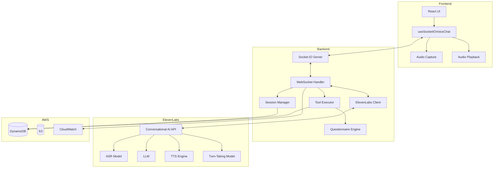
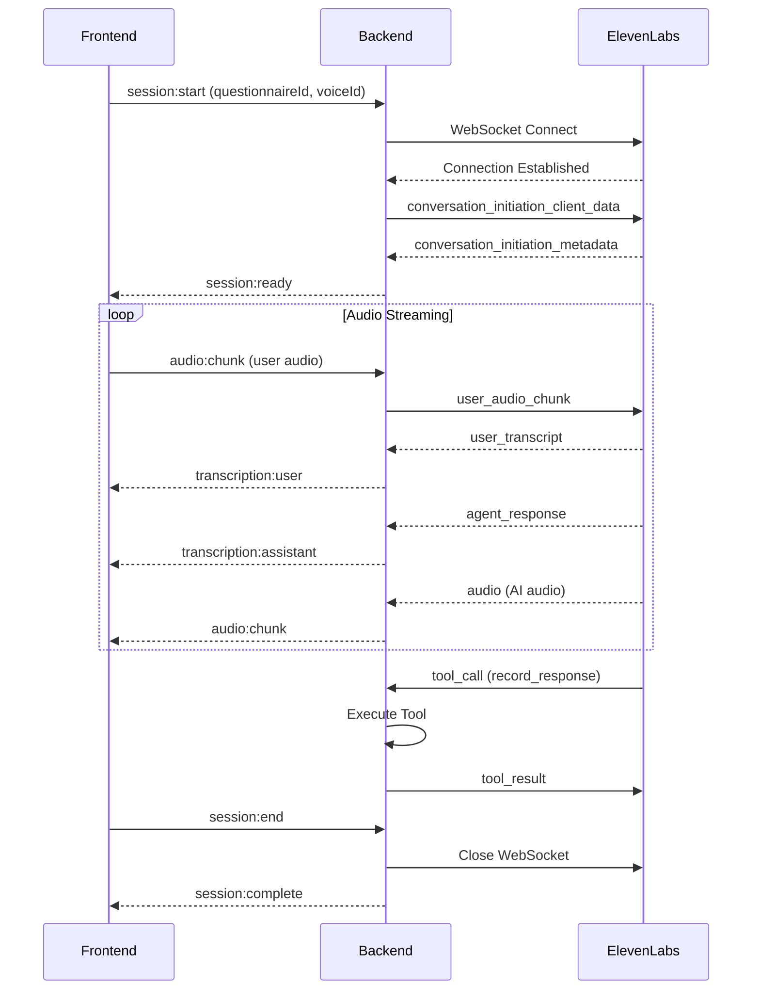

# Design Document: ElevenLabs Migration

## Overview

This design document describes the architecture and implementation approach for migrating the Voiceter voice survey system from Amazon Bedrock Nova 2 Sonic to ElevenLabs Conversational AI platform. The migration replaces the speech-to-speech model while preserving the existing survey functionality, questionnaire logic, and user experience.

### Key Changes

1. **Backend**: Replace Bedrock client with ElevenLabs WebSocket client
2. **Audio Protocol**: Adapt to ElevenLabs event format while maintaining existing frontend interface
3. **Tool Execution**: Map existing tools to ElevenLabs tool call format
4. **Voice Selection**: Map Bedrock voices to ElevenLabs voice library
5. **Configuration**: Add ElevenLabs API credentials and agent configuration

### Architecture Comparison

```
Current (Bedrock):
Frontend → Socket.IO → Backend → Bedrock HTTP/2 Stream → Nova Sonic

New (ElevenLabs):
Frontend → Socket.IO → Backend → ElevenLabs WebSocket → Conversational AI
```

## Architecture

### High-Level Architecture



### Data Flow



## Components and Interfaces

### 1. ElevenLabs Client (`src/elevenlabs/client.ts`)

Manages WebSocket connections to ElevenLabs Conversational AI API.

```typescript
interface ElevenLabsClientConfig {
  apiKey: string;
  agentId: string;
  voiceId?: string;
  outputFormat?: 'mp3_44100' | 'pcm_16000' | 'pcm_22050' | 'pcm_24000' | 'pcm_44100';
}

interface ElevenLabsClient {
  // Connection management
  connect(sessionId: string, config: SessionConfig): Promise<void>;
  disconnect(sessionId: string): Promise<void>;
  isConnected(sessionId: string): boolean;
  
  // Audio streaming
  sendAudioChunk(sessionId: string, audioData: string): void;
  
  // Event handlers
  on(event: 'user_transcript', handler: (data: TranscriptEvent) => void): void;
  on(event: 'agent_response', handler: (data: AgentResponseEvent) => void): void;
  on(event: 'audio', handler: (data: AudioEvent) => void): void;
  on(event: 'interruption', handler: (data: InterruptionEvent) => void): void;
  on(event: 'tool_call', handler: (data: ToolCallEvent) => void): void;
  on(event: 'error', handler: (error: Error) => void): void;
  
  // Tool responses
  sendToolResult(sessionId: string, toolCallId: string, result: any): void;
}
```

### 2. ElevenLabs Event Types (`src/elevenlabs/types.ts`)

```typescript
// Client to ElevenLabs events
interface ConversationInitiationClientData {
  type: 'conversation_initiation_client_data';
  conversation_config_override?: {
    agent?: {
      prompt?: { prompt: string };
      first_message?: string;
      language?: string;
    };
    tts?: {
      voice_id?: string;
    };
  };
  custom_llm_extra_body?: Record<string, any>;
}

interface UserAudioChunk {
  type: 'user_audio_chunk';
  audio_chunk: string; // base64 encoded
}

interface PingEvent {
  type: 'ping';
  event_id: number;
}

// ElevenLabs to Client events
interface UserTranscript {
  type: 'user_transcript';
  user_transcript: string;
}

interface AgentResponse {
  type: 'agent_response';
  agent_response: string;
}

interface AgentResponseCorrection {
  type: 'agent_response_correction';
  agent_response_correction: string;
}

interface AudioEvent {
  type: 'audio';
  audio: string; // base64 encoded
}

interface InterruptionEvent {
  type: 'interruption';
}

interface ToolCallEvent {
  type: 'tool_call';
  tool_call_id: string;
  tool_name: string;
  parameters: Record<string, any>;
}

interface PongEvent {
  type: 'pong';
  event_id: number;
}

interface ConversationInitiationMetadata {
  type: 'conversation_initiation_metadata';
  conversation_id: string;
  agent_output_audio_format: string;
}
```

### 3. Session Manager Updates (`src/session/manager.ts`)

Extended to support ElevenLabs sessions:

```typescript
interface ElevenLabsSessionState {
  sessionId: string;
  questionnaireId: string;
  voiceId: string;
  conversationId?: string; // ElevenLabs conversation ID
  isConnected: boolean;
  startTime: Date;
  lastActivityTime: Date;
  turnCount: number;
  status: 'active' | 'completed' | 'terminated' | 'error';
}

interface SessionManager {
  // Existing methods preserved
  createSession(sessionId: string, config: SessionConfig): Promise<void>;
  getSession(sessionId: string): Promise<Session | null>;
  updateSession(sessionId: string, updates: Partial<Session>): Promise<void>;
  deleteSession(sessionId: string): Promise<void>;
  
  // New ElevenLabs-specific methods
  setElevenLabsConversationId(sessionId: string, conversationId: string): Promise<void>;
  getElevenLabsConversationId(sessionId: string): Promise<string | null>;
}
```

### 4. Tool Executor Updates (`src/tools/executor.ts`)

Adapted for ElevenLabs tool call format:

```typescript
interface ElevenLabsToolCall {
  tool_call_id: string;
  tool_name: string;
  parameters: Record<string, any>;
}

interface ElevenLabsToolResult {
  tool_call_id: string;
  result: any;
  error?: string;
}

interface ToolExecutor {
  // Execute tool from ElevenLabs format
  executeFromElevenLabs(
    toolCall: ElevenLabsToolCall,
    session: Session
  ): Promise<ElevenLabsToolResult>;
}
```

### 5. Voice Mapping (`src/elevenlabs/voice-mapping.ts`)

Maps existing Bedrock voices to ElevenLabs equivalents:

```typescript
const VOICE_MAPPING: Record<string, string> = {
  // Bedrock voice -> ElevenLabs voice ID
  'matthew': 'pNInz6obpgDQGcFmaJgB', // Adam (male, American)
  'tiffany': 'EXAVITQu4vr4xnSDxMaL', // Bella (female, American)
  'amy': 'jBpfuIE2acCO8z3wKNLl',     // Emily (female, British)
};

function mapVoiceId(bedrockVoice: string): string {
  return VOICE_MAPPING[bedrockVoice] || VOICE_MAPPING['matthew'];
}

function isValidElevenLabsVoiceId(voiceId: string): boolean {
  // ElevenLabs voice IDs are 20-character alphanumeric strings
  return /^[a-zA-Z0-9]{20,}$/.test(voiceId);
}
```

### 6. Configuration Updates (`src/server/config.ts`)

```typescript
interface ElevenLabsConfig {
  apiKey: string;
  defaultAgentId: string;
  defaultVoiceId: string;
  agentIdMapping: Record<string, string>; // questionnaireId -> agentId
  outputFormat: 'mp3_44100' | 'pcm_16000' | 'pcm_22050' | 'pcm_24000' | 'pcm_44100';
}

interface Config {
  // Existing config preserved
  aws: AWSConfig;
  server: ServerConfig;
  auth: AuthConfig;
  
  // New ElevenLabs config
  elevenlabs: ElevenLabsConfig;
  
  // Feature flag for gradual rollout
  useElevenLabs: boolean;
}
```

## Data Models

### ElevenLabs Session State

```typescript
interface ElevenLabsSession {
  // Core identifiers
  sessionId: string;
  conversationId: string; // ElevenLabs conversation ID
  
  // Configuration
  questionnaireId: string;
  voiceId: string;
  agentId: string;
  
  // State
  status: 'connecting' | 'active' | 'completed' | 'terminated' | 'error';
  isConnected: boolean;
  
  // Metrics
  startTime: Date;
  lastActivityTime: Date;
  turnCount: number;
  audioChunksReceived: number;
  audioChunksSent: number;
  
  // Conversation history
  transcripts: TranscriptEntry[];
  toolCalls: ToolCallEntry[];
}

interface TranscriptEntry {
  id: string;
  role: 'user' | 'assistant';
  content: string;
  timestamp: Date;
  isFinal: boolean;
}

interface ToolCallEntry {
  toolCallId: string;
  toolName: string;
  parameters: Record<string, any>;
  result: any;
  error?: string;
  executionTime: number;
  timestamp: Date;
}
```

### WebSocket Event Mapping

| Frontend Event | ElevenLabs Event | Direction |
|---------------|------------------|-----------|
| `session:start` | `conversation_initiation_client_data` | Client → ElevenLabs |
| `audio:chunk` | `user_audio_chunk` | Client → ElevenLabs |
| `transcription:user` | `user_transcript` | ElevenLabs → Client |
| `transcription:assistant` | `agent_response` | ElevenLabs → Client |
| `audio:chunk` | `audio` | ElevenLabs → Client |
| `interruption` | `interruption` | ElevenLabs → Client |
| N/A | `tool_call` / `tool_result` | ElevenLabs ↔ Backend |

## Correctness Properties

*A property is a characteristic or behavior that should hold true across all valid executions of a system—essentially, a formal statement about what the system should do. Properties serve as the bridge between human-readable specifications and machine-verifiable correctness guarantees.*

### Property 1: Connection Initialization Correctness

*For any* valid session configuration (sessionId, questionnaireId, voiceId), when a connection is established to ElevenLabs, the client SHALL send a properly formatted `conversation_initiation_client_data` event containing the system prompt and voice configuration.

**Validates: Requirements 1.1, 1.2, 1.3**

### Property 2: Audio Chunk Forwarding Integrity

*For any* audio chunk received from the frontend, the ElevenLabs client SHALL forward it to ElevenLabs as a `user_audio_chunk` event with the same base64-encoded data. Conversely, *for any* audio chunk received from ElevenLabs, the client SHALL forward it to the frontend as an `audio:chunk` event with the same data.

**Validates: Requirements 2.1, 2.3**

### Property 3: Transcription Event Transformation

*For any* `user_transcript` event from ElevenLabs, the client SHALL emit a `transcription:user` event to the frontend with the transcript text, role='user', and a valid timestamp. *For any* `agent_response` event, the client SHALL emit a `transcription:assistant` event with role='assistant'.

**Validates: Requirements 3.1, 3.2, 3.4**

### Property 4: Tool Call Round-Trip Correctness

*For any* `tool_call` event from ElevenLabs, the client SHALL extract the tool name and parameters, execute the tool, and send a `tool_result` event back to ElevenLabs. The tool_call_id in the result SHALL match the original tool_call_id.

**Validates: Requirements 5.1, 5.6, 5.7**

### Property 5: Session Lifecycle Management

*For any* `session:start` event, the Session Manager SHALL create a new session with all required fields (sessionId, questionnaireId, voiceId, status='active'). *For any* `session:end` event, the Session Manager SHALL close the ElevenLabs connection and update status to 'completed' or 'terminated'.

**Validates: Requirements 6.1, 6.2, 6.3**

### Property 6: Voice Mapping Consistency

*For any* Bedrock voice name (matthew, tiffany, amy), the voice mapping function SHALL return a valid ElevenLabs voice ID. *For any* custom ElevenLabs voice ID, the validation function SHALL accept it if it matches the ElevenLabs ID format.

**Validates: Requirements 7.1, 7.4**

### Property 7: Error Handling Completeness

*For any* error that occurs during ElevenLabs communication, the error handler SHALL log the error with sessionId, error code, and stack trace. The error message sent to the frontend SHALL NOT contain internal details (stack traces, API keys, internal paths).

**Validates: Requirements 8.4, 8.5**

### Property 8: Reconnection with Exponential Backoff

*For any* connection failure, the client SHALL attempt reconnection with delays following exponential backoff pattern (1s, 2s, 4s) up to 3 retries. The delay between retry N and retry N+1 SHALL be approximately 2^N seconds.

**Validates: Requirements 1.4, 8.2**

### Property 9: Barge-In Event Propagation

*For any* `interruption` event from ElevenLabs, the client SHALL immediately emit an `interruption` event to the frontend to stop audio playback.

**Validates: Requirements 2.5**

### Property 10: Configuration Validation at Startup

*For any* missing required configuration (ELEVENLABS_API_KEY, ELEVENLABS_AGENT_ID), the application SHALL fail to start with a clear error message indicating which configuration is missing.

**Validates: Requirements 10.6**

### Property 11: Logging Traceability

*For any* log entry emitted during ElevenLabs communication, the log SHALL include the sessionId field for traceability. *For any* ElevenLabs event (connection, audio, transcription, tool call), a structured log entry SHALL be emitted.

**Validates: Requirements 11.5, 11.6**

### Property 12: Stale Session Cleanup

*For any* session with lastActivityTime older than 30 minutes, the cleanup process SHALL close the ElevenLabs connection and remove the session from memory.

**Validates: Requirements 6.4**

### Property 13: Frontend State Machine Validity

*For any* state transition in the frontend connection hook, the transition SHALL follow the valid state machine: DISCONNECTED → CONNECTING → INITIALIZING → READY, or any state → DISCONNECTED on error/disconnect.

**Validates: Requirements 9.6**

## Error Handling

### Error Categories

1. **Connection Errors**: WebSocket connection failures, authentication errors
2. **Streaming Errors**: Audio chunk transmission failures, timeout errors
3. **Tool Execution Errors**: Tool not found, invalid parameters, execution timeout
4. **Session Errors**: Session not found, session expired, invalid state transition

### Error Codes

| Error Code | Description | Recoverable |
|------------|-------------|-------------|
| `ELEVENLABS_CONNECTION_FAILED` | Failed to connect to ElevenLabs API | Yes (retry) |
| `ELEVENLABS_AUTH_FAILED` | API key invalid or expired | No |
| `ELEVENLABS_RATE_LIMITED` | Rate limit exceeded | Yes (backoff) |
| `ELEVENLABS_STREAM_ERROR` | Error during audio streaming | Yes (reconnect) |
| `ELEVENLABS_TOOL_TIMEOUT` | Tool execution exceeded 5 seconds | Yes |
| `ELEVENLABS_TOOL_ERROR` | Tool execution failed | Yes |
| `SESSION_NOT_FOUND` | Session ID not found | No |
| `SESSION_EXPIRED` | Session timed out | No |
| `INVALID_AUDIO_FORMAT` | Audio format not supported | No |

### Error Response Format

```typescript
interface ErrorResponse {
  event: 'error';
  sessionId: string;
  timestamp: string;
  data: {
    errorCode: string;
    errorMessage: string; // User-friendly message
    recoverable: boolean;
    retryAfter?: number; // Seconds to wait before retry
  };
}
```

## Testing Strategy

### Unit Tests

- **ElevenLabs Client**: Test connection, disconnection, event handling
- **Voice Mapping**: Test all voice mappings and validation
- **Tool Executor**: Test tool execution with ElevenLabs format
- **Session Manager**: Test session lifecycle with ElevenLabs state
- **Configuration**: Test validation and defaults

### Property-Based Tests (fast-check)

Each correctness property will be implemented as a property-based test with minimum 100 iterations:

1. **Connection Initialization**: Generate random session configs, verify initialization event format
2. **Audio Forwarding**: Generate random audio chunks, verify round-trip integrity
3. **Transcription Transformation**: Generate random transcripts, verify event transformation
4. **Tool Call Round-Trip**: Generate random tool calls, verify execution and response
5. **Session Lifecycle**: Generate random session events, verify state transitions
6. **Voice Mapping**: Generate random voice IDs, verify mapping consistency
7. **Error Handling**: Generate random errors, verify logging and sanitization
8. **Reconnection Backoff**: Simulate failures, verify retry timing
9. **Barge-In Propagation**: Generate interruption events, verify propagation
10. **Config Validation**: Generate invalid configs, verify error messages
11. **Logging Traceability**: Generate events, verify sessionId presence
12. **Stale Session Cleanup**: Generate stale sessions, verify cleanup
13. **State Machine Validity**: Generate state transitions, verify validity

### Integration Tests

- **End-to-End Flow**: Test complete survey flow with mocked ElevenLabs
- **WebSocket Communication**: Test Socket.IO ↔ Backend ↔ ElevenLabs
- **Database Integration**: Test session and response persistence

### Load Tests

- **Concurrent Sessions**: Test 50+ concurrent ElevenLabs connections
- **Audio Throughput**: Test sustained audio streaming
- **Tool Execution**: Test tool execution under load
